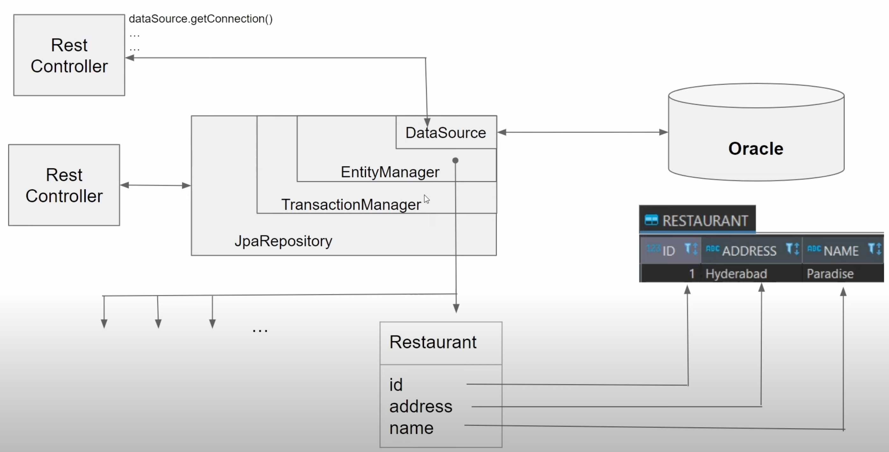

## Spring Multiple Database


### Swagger Link to test the endpoints
http://localhost:8081/swagger-ui/index.html

### Takeaway

GenerationType.IDENTITY is mainly used for MySQL DB. The IDENTITY strategy relies on an auto-incremented database column. 
This is commonly used in MySQL and SQL Server.
In MySQL we cannot create sequence explicitly
```
CREATE TABLE currency (
id INT UNSIGNED NOT NULL AUTO_INCREMENT,
currency_name VARCHAR(30) NOT NULL,
description VARCHAR(30) NOT NULL,
PRIMARY KEY (id),
UNIQUE (id)
);

```
When using GenerationType.IDENTITY, the database generates a new value with each insert operation. This strategy is simple but can lead to performance issues with batch inserts.

https://medium.com/@bytewise010/spring-boot-identifiers-30454276449a

#### Spring Datasource



